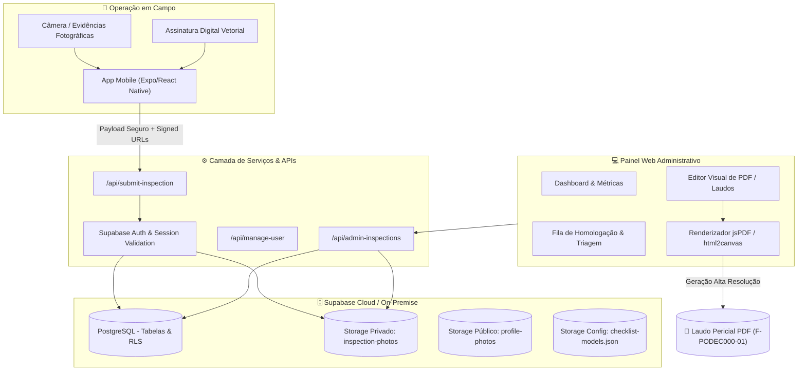

<div align="center">

# 📋 Vistorias EN — Web & Gestão Central de Laudos

**Plataforma Corporativa de Auditoria, Workflow de Aprovação e Customização Dinâmica de Relatórios Técnicos Veiculares**

[](https://react.dev/)
[](https://vitejs.dev/)
[](https://supabase.com/)
[](https://github.com/parallax/jsPDF)
[](#)

</div>

---

## 📌 Visão Geral do Sistema

O **Vistorias EN Web** é o núcleo operacional e administrativo do ecossistema de inspeção veicular e controle de qualidade de frotas da empresa. Projetado para suportar auditorias rigorosas em cavalos mecânicos, carretas, implementos rodoviários e frotas leves, o sistema centraliza:

1. **Recepção em Tempo Real**: Coleta de vistorias executadas em campo pelo app mobile, com dados criptografados, geolocalização e fotos comprobatórias.
2. **Workflow de Auditoria & Homologação**: Triagem de vistorias pendentes (`Aguardando aprovação`), validação técnica dos apontamentos, aprovação com carimbo digital ou reprovação com justificativa circunstanciada.
3. **Editor & Customizador de PDF em Tempo Real**: Interface visual para personalização completa do laudo pericial (cabeçalhos, logomarcas, tabelas de conformidade, seções regulatórias, código de formulário da qualidade e anexos fotográficos).
4. **Controle de Modelos de Checklist (Checklist Builder)**: Criação e manutenção de questionários dinâmicos com exigência de foto obrigatória por item, notas de não conformidade e árvore de criticidade.
5. **Gestão de Usuários & Perfis**: Controle de permissões (Administradores, Supervisores e Vistoriadores de Campo) com logs de auditoria e fotos de perfil.

---

## 🏗️ Arquitetura do Sistema



---

## ✨ Principais Funcionalidades

### 1. 🎛️ Editor & Customizador de Laudo PDF em Tempo Real
O painel conta com um motor completo de personalização visual do laudo pericial gerado para clientes, seguradoras e fiscalização:
- **Identidade Visual**: Logomarca da empresa, Razão Social, CNPJ, Telefone institucional e E-mail.
- **Títulos e Subtítulos**: Customização de títulos do laudo e cabeçalho de seções.
- **Tabelas de Não Conformidade**: Opção para exibir ou ocultar colunas de grupos, pontuação de penalidades e notas de vistoriador.
- **Assinaturas Digitais**: Renderização vetorial das assinaturas de condutor e vistoriador com linhas de fé pública e cargos configuráveis.
- **Controle de Qualidade ISO**: Ajuste dinâmico do código de formulário (ex: `F-PODEC000-01`), número de revisão e data de geração.
- **Anexo Fotográfico Inteligente**: Grid automático de fotos que se adapta conforme a quantidade (foto ampliada em destaque ou disposição em grade lado a lado com timestamps).

### 2. 🚦 Esteira de Homologação e Triagem
- Filtro por status: **Aguardando aprovação** (`completed`), **Aprovada / Concluída** (`approved`) e **Reprovada** (`rejected`).
- Visualização instantânea de todos os itens com "Não Conforme", destacando fotos de evidência e justificativas digitadas pelo vistoriador em campo.
- Ações rápidas de homologação com registro do auditor responsável e data/hora da decisão.

### 3. 📝 Construtor de Checklists Dinâmicos
- Estruturação de formulários por categorias (Pneus, Freios, Sistema Elétrico, Cabine, Carga, Documentação).
- Configuração de obrigatoriedade de fotos para itens específicos.
- Flag de justificativa obrigatória quando um item for marcado como "Não Conforme".
- Sincronização automática com todos os aparelhos móveis sem necessidade de recompilar o app.

### 4. 👥 Controle de Usuários (RBAC)
- Níveis de acesso: `admin`, `supervisor`, `vistoriador`.
- Gerenciamento completo de credenciais, unidades operacionais permitidas e fotos de perfil.
- Bloqueio imediato de acessos e auditoria de atividades.

---

## 📁 Estrutura de Diretórios

```text
vistorias-web/
├── api/                         # Serverless Functions & Endpoints de Backend
│   ├── admin-inspections.js     # Listagem, filtragem e aprovação de vistorias
│   ├── admin-profiles.js        # Gestão de perfis e listagem de colaboradores
│   ├── manage-user.js           # Criação, edição e exclusão segura de usuários
│   ├── mobile-inspections.js    # Endpoint de sincronização consumido pelo app
│   ├── register-push-token.js   # Registro de tokens FCM/Expo para notificações
│   ├── session-profile.js       # Validação de sessão e permissões do usuário
│   ├── submit-inspection.js     # Processamento do envio de vistoria e fotos
│   ├── update-profile-photo.js  # Upload e redimensionamento de foto de perfil
│   └── web-login.js             # Autenticação administrativa com Supabase Auth
├── database/                    # Scripts SQL e migrações
│   └── supabase-schema.sql      # Schema completo (tabelas, índices, triggers e RLS)
├── docs/                        # Documentação técnica e operacional
│   └── IMPLEMENTACAO.md         # Guia detalhado de deploy, buckets e infraestrutura
├── public/                      # Assets estáticos servidos diretamente
│   ├── favicon.ico
│   └── logo.png
├── shared/                      # Regras de negócio e esquemas compartilhados
│   ├── checklist-model-store.js # Leitura e persistência dos modelos de checklist
│   └── checklist-models.js      # Estrutura padrão de itens e seções de inspeção
├── src/                         # Código-fonte da aplicação React
│   ├── main.jsx                 # Entrada principal, roteamento, telas e PDF customizer
│   └── styles.css               # Folha de estilos moderna com Design System corporativo
├── Dockerfile                   # Build de container para deploy On-Premise / VPS
├── package.json                 # Dependências e scripts npm
├── server.js                    # Servidor Node.js standalone para VPS / On-Premise
├── vercel.json                  # Roteamento e configurações de deploy na Vercel
└── README.md                    # Documentação técnica do projeto
```

---

## 🚀 Como Executar o Projeto

### Pré-requisitos
- **Node.js** 20+ e **npm** 10+
- Conta ou instância própria do **Supabase** com o schema SQL aplicado

### 1. Clonagem e Instalação
```bash
git clone https://github.com/canestrimatheus-ai/Vistorias-EN---Web.git
cd Vistorias-EN---Web
npm install
```

### 2. Configuração de Variáveis de Ambiente
Crie um arquivo `.env.local` na raiz do projeto:

```env
# URL base da sua instância Supabase
VITE_SUPABASE_URL=https://seu-projeto.supabase.co

# Chave pública (Anon / Publishable) para o frontend
VITE_SUPABASE_PUBLISHABLE_KEY=eyJhbGciOiJIUzI1NiIsInR5cCI6IkpXVCJ9...

# Chave privada (Service Role) - EXCLUSIVA PARA /api (NUNCA EXPONHA NO CLIENTE)
SUPABASE_SERVICE_ROLE_KEY=eyJhbGciOiJIUzI1NiIsInR5cCI6IkpXVCJ9...
```

### 3. Execução em Ambiente de Desenvolvimento
```bash
npm run dev
```
O painel estará disponível em `http://localhost:5173`.

### 4. Build de Produção
```bash
npm run build
npm run preview
```
Os arquivos otimizados serão gerados no diretório `dist/`.

---

## 🚢 Opções de Deploy

### Opção A: Vercel (Cloud Serverless)
O projeto está pré-configurado com `vercel.json` para hospedar o frontend estático e as rotas `/api` como Vercel Functions:
1. Conecte o repositório na Vercel.
2. Adicione as variáveis de ambiente (`VITE_SUPABASE_URL`, `VITE_SUPABASE_PUBLISHABLE_KEY`, `SUPABASE_SERVICE_ROLE_KEY`).
3. Deploy automático a cada push na branch `main`.

### Opção B: On-Premise / Docker / VPS Própria (Zero Custo de Nuvem)
Graças ao `server.js` e ao `Dockerfile`, o sistema pode rodar em qualquer servidor Linux sem depender da Vercel:

```bash
# Construir a imagem Docker
docker build -t vistorias-web:latest .

# Executar o container na porta 3000
docker run -d \
  --name vistorias-web \
  -p 3000:3000 \
  -e VITE_SUPABASE_URL="https://seu-projeto.supabase.co" \
  -e VITE_SUPABASE_PUBLISHABLE_KEY="sua_chave_publica" \
  -e SUPABASE_SERVICE_ROLE_KEY="sua_chave_privada" \
  --restart unless-stopped \
  vistorias-web:latest
```

---

## 🔒 Segurança & Políticas de Acesso

- **Separação de Chaves**: A chave `SUPABASE_SERVICE_ROLE_KEY` é acessada estritamente pelo backend Node/Serverless Functions. O frontend expõe apenas a chave anônima/pública.
- **Signed URLs**: As fotos dos veículos e documentos contêm dados confidenciais e ficam em um bucket privado (`inspection-photos`). Elas são servidas através de URLs temporárias assinadas com validade controlada.
- **Auditoria de Decisões**: Cada aprovação ou reprovação registra o ID do usuário que homologou e o exato timestamp da ação.

---

## 📄 Licença & Propriedade
Projeto de uso exclusivo e proprietário. Proibida a reprodução ou distribuição não autorizada.
